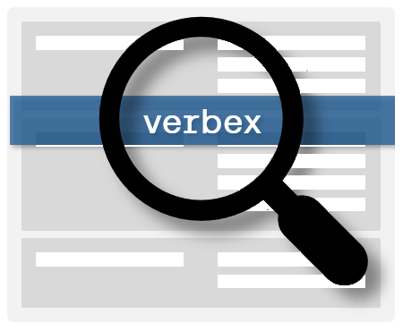

<div align="center">
  

  # Verbex

  [](https://nuget.org/packages/Verbex)
  
  

  **A high-performance, feature-rich inverted index library for .NET 8.0 with multiple storage modes, advanced caching, and comprehensive search capabilities.**

  **Verbex is in ALPHA** - we welcome your feedback, improvements, bugfixes, and deliciously harsh criticisms
</div>

Verbex provides a production-ready inverted index implementation that scales from simple in-memory operations to enterprise-grade persistent storage. Built with performance, reliability, and ease of use in mind.

## Screenshots

<div align="center">
  
</div>

<div align="center">
  
</div>

<div align="center">
  
</div>

## Table of Contents

- [Screenshots](#screenshots)
- [What is Verbex?](#what-is-verbex)
- [Who Should Use Verbex?](#who-should-use-verbex)
- [Key Features](#key-features)
- [Use Cases](#use-cases)
- [Quick Start](#quick-start)
- [Command Line Interface](#command-line-interface)
- [Storage Modes](#storage-modes)
- [Storage Architecture](#storage-architecture)
- [Text Processing Features](#text-processing-features)
- [Interactive Testing](#interactive-testing)
- [REST API Server](#rest-api-server)
- [Docker Support](#docker-support)
- [Advanced Usage](#advanced-usage)
- [Performance](#performance)
- [Configuration](#configuration)
- [Support](#support)
- [Contributing](#contributing)
- [License](#license)

## What is Verbex?

Verbex is a comprehensive inverted index library that enables fast, scalable full-text search capabilities in .NET applications. An inverted index is a data structure that maps each unique term in a document collection to a list of documents containing that term, enabling efficient search and retrieval operations.

Unlike simple text search solutions, Verbex provides:
- **Multiple storage strategies** (in-memory SQLite, on-disk SQLite)
- **TF-IDF scoring algorithm** for relevance ranking
- **Thread-safe concurrent operations** using ReaderWriterLockSlim
- **Comprehensive statistics and analytics**
- **Configurable tokenization and processing**
- **Document metadata** (labels and tags) for filtering

## Who Should Use Verbex?

Verbex is ideal for developers and organizations who need:

### **Application Developers**
- Building applications with search functionality
- Need fast, in-memory search for moderate datasets
- Want to avoid heavy search engine dependencies
- Require precise control over indexing and search behavior

### **Enterprise Teams**
- Managing large document collections
- Need persistent, scalable search infrastructure
- Require detailed analytics and performance monitoring
- Want hybrid storage for optimal performance/cost balance

### **Research and Analytics**
- Processing text corpora for analysis
- Need detailed term frequency and document statistics
- Require flexible, programmable search interfaces
- Want to experiment with different ranking algorithms

### **Embedded Systems**
- IoT devices with text processing needs
- Edge computing scenarios
- Lightweight search in resource-constrained environments
- Offline-first applications with search requirements

## Key Features

### **🚀 High Performance**
- Thread-safe concurrent operations using ReaderWriterLockSlim
- Optimized SQLite-based data structures
- Efficient term and document lookups

### **💾 Flexible Storage**
- **In-Memory**: Lightning-fast SQLite in-memory database
- **On-Disk**: Persistent SQLite file storage for production use

### **🔍 Advanced Search**
- TF-IDF relevance scoring
- Boolean AND/OR query logic
- Phrase search capabilities
- Term frequency and document statistics

### **⚙️ Highly Configurable**
- Customizable tokenization strategies
- Configurable lemmatization and stop word removal
- Document labels and tags for metadata filtering
- Extensible text processing pipeline

### **📊 Comprehensive Analytics**
- Real-time index statistics
- Term frequency analysis
- Memory usage monitoring
- Performance benchmarking tools

### **🔧 Developer Friendly**
- Intuitive API design
- Comprehensive XML documentation
- Interactive testing console
- Extensive test suite (102+ tests)

## Use Cases

### **Document Management Systems**
```csharp
var config = new VerbexConfiguration
{
    StorageMode = StorageMode.OnDisk,
    StorageDirectory = @"C:\Documents\Index"
};
var index = new InvertedIndex(config);

// Index documents
await index.AddDocumentAsync(docId, content, filePath);

// Search with relevance scoring
var results = await index.SearchAsync("machine learning algorithms");
```

### **Log Analysis and Monitoring**
```csharp
var index = new InvertedIndex(new VerbexConfiguration
{
    StorageMode = StorageMode.InMemory
});

// Index log entries in real-time
await index.AddDocumentAsync(Guid.NewGuid(), logEntry, logSource);

// Find relevant log entries
var errorLogs = await index.SearchAsync("ERROR exception stack", useAndLogic: true);
```

### **Content Discovery Platforms**
```csharp
var config = new VerbexConfiguration
{
    StorageMode = StorageMode.OnDisk,
    StorageDirectory = @"C:\Data\ContentIndex",
    DefaultMaxSearchResults = 50
};
var index = new InvertedIndex(config);

// Search with detailed results
var searchResults = await index.SearchResultsAsync("artificial intelligence");
foreach (var result in searchResults.Results)
{
    Console.WriteLine($"Document: {result.DocumentId}, Score: {result.Score:F4}");
}
```

### **Research and Text Analytics**
```csharp
// Get comprehensive statistics
var stats = await index.GetIndexStatisticsAsync();
Console.WriteLine($"Documents: {stats.DocumentCount:N0}");
Console.WriteLine($"Unique Terms: {stats.TermCount:N0}");

// Analyze specific terms
var termStats = await index.GetTermStatisticsAsync("algorithm");
Console.WriteLine($"Term frequency: {termStats.CollectionFrequency}");
```

## Quick Start

### 1. Installation

```bash
# Clone the repository
git clone https://github.com/jchristn/verbex.git
cd verbex

# Build the solution
dotnet build

# Run the comprehensive test suite
dotnet run --project src/Test
```

### 2. Basic Usage

```csharp
using Verbex;

// Create a simple in-memory index
var config = new VerbexConfiguration { StorageMode = StorageMode.InMemory };
using var index = new InvertedIndex(config);

// Add documents
await index.AddDocumentAsync(
    Guid.NewGuid(),
    "The quick brown fox jumps over the lazy dog",
    "document1.txt"
);

await index.AddDocumentAsync(
    Guid.NewGuid(),
    "Machine learning algorithms process vast amounts of data",
    "document2.txt"
);

// Search documents
var results = await index.SearchAsync("fox machine");
foreach (var result in results)
{
    Console.WriteLine($"Found in document: {result.DocumentId}");
    Console.WriteLine($"Relevance score: {result.Score:F4}");
}

// Get statistics
var stats = await index.GetIndexStatisticsAsync();
Console.WriteLine($"Total documents: {stats.DocumentCount}");
Console.WriteLine($"Unique terms: {stats.TermCount}");
```

### 3. Command Line Interface

Verbex includes a professional command-line interface (`vbx`) for direct index management:

```bash
# Create a production index with advanced text processing
vbx index create production --storage disk --lemmatizer --stopwords

# Add documents
vbx doc add guide --content "Complete guide to machine learning algorithms"
vbx doc add manual --file ./documentation.txt --tag category=docs

# Search with different strategies
vbx search "machine learning" --and --limit 10
vbx search "algorithms" --filter category=docs

# Monitor performance and statistics
vbx index info production
```

For complete CLI documentation, see the **[VBX CLI Guide](VBX_CLI.md)**.

### 4. Interactive Testing

Verbex includes a comprehensive interactive console for testing and exploration:

```bash
# Launch the interactive test console
dotnet run --project src/TestConsole
```

The TestConsole provides comprehensive commands for testing:

```
> help                                    # Show all commands
> index create --mode disk                # Create on-disk index
> demo                                    # Load sample data
> search "machine learning"               # Search documents
> search "fox dog" --and                  # AND search
> stats                                   # Show index statistics
> benchmark                               # Run performance tests
> stress                                  # Run stress test with 1000+ docs
```

## Command Line Interface

Verbex includes the **VBX CLI** - a professional command-line interface that provides enterprise-grade functionality for creating, managing, and searching document indices. The CLI follows industry standards from tools like AWS CLI, kubectl, and Docker CLI.

### Installation

The VBX CLI compiles to a single executable (`vbx.exe`) with support for ARM64/x64 on Windows, Linux, and macOS:

```bash
# Build the CLI
dotnet publish src/VerbexCli -c Release -r win-x64 --self-contained

# Binary location
./src/VerbexCli/bin/Release/net8.0/win-x64/publish/vbx.exe
```

### Key Features

- **Professional Command Structure** - Intuitive subcommands and options
- **Multiple Output Formats** - Table, JSON, CSV, YAML
- **Colored Terminal Output** - Enhanced readability with smart detection
- **Advanced Text Processing** - Lemmatization, stop words, token filtering
- **Performance Tools** - Built-in benchmarking and stress testing
- **Cross-Platform** - Single binary deployment for all platforms

### Example Usage

```bash
# Create advanced index
vbx index create docs --storage disk --lemmatizer --stopwords --min-length 3

# Set as active index
vbx index use docs

# Add documents
vbx doc add readme --content "Getting started with Verbex library"
vbx doc add guide --file ./user-guide.md --tag type=documentation

# Search with different strategies
vbx search "getting started" --and
vbx search "verbex library" --limit 5
vbx search "library" --filter type=documentation

# View index information
vbx index info docs
```

### Complete Documentation

For comprehensive CLI documentation including all commands, options, and examples, see the **[VBX CLI Guide](VBX_CLI.md)**.

## Storage Modes

Verbex supports two storage modes using SQLite as the underlying database:

### In-Memory Mode
**Best for**: Fast operations, temporary indexes, development/testing

```csharp
var config = new VerbexConfiguration
{
    StorageMode = StorageMode.InMemory
};
// Or use the factory method:
var config = VerbexConfiguration.CreateInMemory();
```

- ✅ Lightning-fast operations using SQLite in-memory database
- ✅ No disk I/O overhead
- ❌ Data lost on application restart
- ❌ Limited by available RAM

### On-Disk Mode
**Best for**: Production systems, persistent storage, large datasets

```csharp
var config = new VerbexConfiguration
{
    StorageMode = StorageMode.OnDisk,
    StorageDirectory = @"C:\VerbexData"
};
// Or use the factory method:
var config = VerbexConfiguration.CreateOnDisk(@"C:\VerbexData");
```

- ✅ Persistent across restarts
- ✅ Handles datasets larger than RAM
- ✅ ACID compliance through SQLite
- ❌ Slightly slower than in-memory operations

## Storage Architecture

Verbex uses SQLite as the storage engine for both modes:

| Mode | Storage | Database |
|------|---------|----------|
| `InMemory` | SQLite in-memory | Data in RAM, lost on dispose |
| `OnDisk` | SQLite file | Data in `index.db` file, persistent |

**Default Storage Location for CLI**: `~/.vbx/indices/{indexName}/`

For comprehensive documentation on file management, compaction, recovery, backup strategies, and troubleshooting, see the **[Storage Architecture Guide](STORAGE.md)**.

## Text Processing Features

Verbex provides advanced text processing capabilities to improve search quality and reduce index size through intelligent filtering and normalization.

### Lemmatization

Reduce words to their base or dictionary form using the built-in `BasicLemmatizer`:

```csharp
var config = new VerbexConfiguration
{
    StorageMode = StorageMode.InMemory,
    Lemmatizer = new BasicLemmatizer()
};

using var index = new InvertedIndex(config);

// Index document with various word forms
await index.AddDocumentAsync(
    Guid.NewGuid(),
    "The cats were running quickly through the gardens",
    "document.txt"
);

// All these searches will find the same document
var results1 = await index.SearchAsync("cat");      // finds "cats"
var results2 = await index.SearchAsync("run");      // finds "running"
var results3 = await index.SearchAsync("garden");   // finds "gardens"
```

**Features**:
- Handles irregular verbs (was/were → be, went → go)
- Handles irregular nouns (children → child, mice → mouse)
- Applies common suffix rules (-ing, -ed, -ly, -s)
- Case-insensitive processing
- Thread-safe for concurrent access

### Stop Word Removal

Filter out common words that don't contribute meaningful content using `BasicStopWordRemover`:

```csharp
var config = new VerbexConfiguration
{
    StorageMode = StorageMode.InMemory,
    StopWordRemover = new BasicStopWordRemover()
};

using var index = new InvertedIndex(config);

// Stop words (the, and, in, etc.) are filtered out during indexing
await index.AddDocumentAsync(
    Guid.NewGuid(),
    "The quick brown fox jumps over the lazy dog and runs in the forest",
    "document.txt"
);

// Content words are searchable
var contentResults = await index.SearchAsync("quick brown fox");  // ✓ Found

// Stop words are not searchable
var stopWordResults = await index.SearchAsync("the and");         // ✗ No results
```

**Built-in Stop Words Include**:
- Articles: a, an, the
- Prepositions: at, by, for, from, in, on, to, with
- Pronouns: i, me, you, he, she, it, they
- Common verbs: am, is, are, was, were, have, has
- Conjunctions: and, or, but, if, when, where

### Token Length Filtering

Control which terms are indexed based on their length to reduce noise and index size:

```csharp
var config = new VerbexConfiguration
{
    StorageMode = StorageMode.InMemory,
    MinTokenLength = 3,        // Ignore very short words
    MaxTokenLength = 15        // Ignore very long words
};

using var index = new InvertedIndex(config);

await index.AddDocumentAsync(
    Guid.NewGuid(),
    "A cat, dog, elephant, and supercalifragilisticexpialidocious animal",
    "document.txt"
);

// Words within length range are searchable
var results1 = await index.SearchAsync("cat");      // ✓ Found (length 3)
var results2 = await index.SearchAsync("elephant"); // ✓ Found (length 8)

// Words outside length range are filtered out
var results3 = await index.SearchAsync("A");        // ✗ No results (too short)
var results4 = await index.SearchAsync("supercalifragilisticexpialidocious"); // ✗ No results (too long)
```

**Configuration**:
- `MinTokenLength`: Valid range 1 to Int32.MaxValue (0 = disabled)
- `MaxTokenLength`: Valid range 1 to Int32.MaxValue (0 = disabled)
- Settings are immutable after index instantiation
- Parameters survive crashes in disk-based storage modes

### Combined Text Processing

All text processing features can be used together for maximum search quality:

```csharp
var config = new VerbexConfiguration
{
    StorageMode = StorageMode.OnDisk,
    StorageDirectory = @"C:\Data\Index",
    MinTokenLength = 3,
    MaxTokenLength = 20,
    Lemmatizer = new BasicLemmatizer(),
    StopWordRemover = new BasicStopWordRemover()
};

using var index = new InvertedIndex(config);

await index.AddDocumentAsync(
    Guid.NewGuid(),
    "The researchers were analyzing the computational complexities of machine learning algorithms",
    "research.txt"
);

// Processing pipeline:
// 1. Tokenization: ["The", "researchers", "were", "analyzing", ...]
// 2. Stop word removal: ["researchers", "analyzing", "computational", ...]
// 3. Length filtering: All remaining words are 3-20 characters
// 4. Lemmatization: "researchers" → "researcher", "analyzing" → "analyze"

// Search finds processed terms
var results = await index.SearchAsync("researcher analyze computation machine learn algorithm");
```

### Testing Text Processing

Use the interactive TestConsole to experiment with text processing:

```bash
dotnet run --project src/TestConsole

# Create index with text processing
> index create --mode memory --name advanced --lemmatizer --stopwords

# Test lemmatizer
> debug running --lemmatizer
Lemmatized: running -> run

# Test stop words
> debug the --stopwords
Stop Word: Yes (would be filtered)

# Add documents and test search behavior
> add doc1 --content "The cats were running quickly"
> search "cat run quick"
```

### Thread Safety

All text processing components are thread-safe and designed for concurrent access:
- `BasicLemmatizer` uses static lookup tables with immutable data
- `BasicStopWordRemover` uses static hash sets for fast lookup
- Token length filtering is parameter-based with no shared state
- Processing occurs independently for each document/search operation

## Interactive Testing

The TestConsole application provides a comprehensive interactive environment for testing and exploring Verbex functionality:

### Index Management Commands
```bash
index create [options]      # Create new index
  --mode memory|disk        # Storage mode
  --name <name>             # Index name
  --lemmatizer              # Enable lemmatization
  --stopwords               # Enable stop word removal
index use <name>            # Switch to index
index list                  # List available indices
index show                  # Show current configuration
index save <name>           # Save index to disk
index reload <name>         # Reload index from disk
```

### Document Operations
```bash
add <name> [options]        # Add document
  --content "<text>"        # Inline content
  --file <path>             # Load from file
  --label <label>           # Add label (repeatable)
  --tag key=value           # Add tag (repeatable)
remove <name>               # Remove document
list                        # List all documents
clear --force               # Remove all documents
```

### Search and Analysis
```bash
search "<query>" [options]  # Search documents
  --and                     # Use AND logic (default: OR)
  --filter key=value        # Metadata filter (repeatable)
  --limit <n>               # Max results
stats [term]                # Index or term statistics
debug <term> [options]      # Debug term analysis
  --lemmatizer              # Show lemmatization
  --stopwords               # Check stop word status
cache                       # Cache utilization info
```

### Maintenance and Testing
```bash
flush                       # Force flush write buffer
gc                          # Run garbage collection
demo                        # Load demonstration data
benchmark                   # Performance benchmark
stress                      # Stress test (1000+ documents)
export <file>               # Export index data to JSON
```

### Console Operations
```bash
cls                         # Clear console screen
exit/quit/q                 # Exit application
```

## REST API Server

Verbex includes a production-ready REST API server for web-based applications:

### Running the Server

```bash
# Start the REST API server
dotnet run --project src/Verbex.Server

# Server starts on http://localhost:8080
```

### API Endpoints

- `POST /v1.0/auth/login` - Authenticate and get token
- `GET /v1.0/indices` - List all indices
- `POST /v1.0/indices` - Create a new index
- `GET /v1.0/indices/{id}` - Get index details
- `DELETE /v1.0/indices/{id}` - Delete an index
- `GET /v1.0/indices/{id}/documents` - List documents in index
- `POST /v1.0/indices/{id}/documents` - Add a document
- `GET /v1.0/indices/{id}/documents/{docId}` - Get document
- `DELETE /v1.0/indices/{id}/documents/{docId}` - Delete document
- `POST /v1.0/indices/{id}/search` - Search documents

### Example API Usage

```bash
# Authenticate
curl -X POST http://localhost:8080/v1.0/auth/login \
  -H "Content-Type: application/json" \
  -d '{"Username": "admin", "Password": "password"}'

# Add a document (with token)
curl -X POST http://localhost:8080/v1.0/indices/myindex/documents \
  -H "Content-Type: application/json" \
  -H "Authorization: Bearer YOUR_TOKEN" \
  -d '{"Content": "Machine learning algorithms", "Labels": ["tech"], "Tags": {"category": "ml"}}'

# Search documents
curl -X POST "http://localhost:8080/v1.0/indices/myindex/search" \
  -H "Content-Type: application/json" \
  -H "Authorization: Bearer YOUR_TOKEN" \
  -d '{"Query": "machine learning", "MaxResults": 10}'
```

For complete API documentation, see the **[REST API Documentation](REST_API.md)**.

## Docker Support

Verbex.Server can be containerized for easy deployment:

### Building the Docker Image

```bash
# Build the Docker image
docker build -t jchristn/verbex:v1.0.0 -f src/Verbex.Server/Dockerfile .
```

### Running with Docker

```bash
# Run the container
docker run -p 8080:8080 jchristn/verbex:v1.0.0

# Run with persistent storage
docker run -p 8080:8080 -v /host/data:/app/data jchristn/verbex:v1.0.0
```

### Docker Compose

```yaml
version: '3.8'
services:
  verbex:
    image: jchristn/verbex:v1.0.0
    ports:
      - "8080:8080"
    volumes:
      - ./data:/app/data
```

## Advanced Usage

### Custom Configuration

```csharp
var config = new VerbexConfiguration
{
    StorageMode = StorageMode.OnDisk,
    StorageDirectory = @"C:\VerbexData",

    // Text processing
    MinTokenLength = 2,
    MaxTokenLength = 50,
    Lemmatizer = new BasicLemmatizer(),
    StopWordRemover = new BasicStopWordRemover(),

    // Search configuration
    DefaultMaxSearchResults = 100
};

using var index = new InvertedIndex(config);
```

### Custom Tokenization

```csharp
public class CustomTokenizer : ITokenizer
{
    public string[] Tokenize(string content)
    {
        // Implement custom tokenization logic
        return content.Split(' ', StringSplitOptions.RemoveEmptyEntries)
                     .Select(t => t.ToLowerInvariant().Trim('!', '?', '.', ','))
                     .Where(t => t.Length > 2)
                     .ToArray();
    }
}

var config = new VerbexConfiguration
{
    StorageMode = StorageMode.InMemory,
    Tokenizer = new CustomTokenizer()
};
var index = new InvertedIndex(config);
```

### Batch Operations

```csharp
// Process multiple documents efficiently
var documents = GetDocumentsToIndex();
var tasks = new List<Task>();

foreach (var doc in documents)
{
    tasks.Add(index.AddDocumentAsync(doc.Id, doc.Content, doc.Path));

    if (tasks.Count >= 10) // Process in batches
    {
        await Task.WhenAll(tasks);
        tasks.Clear();
    }
}

await Task.WhenAll(tasks); // Process remaining
await index.FlushAsync(); // Ensure all data is persisted
```

## Performance

Verbex is designed for high performance across different workloads:

### Benchmarks

**Hardware**: Intel i7-10700K, 32GB RAM, NVMe SSD

| Operation | InMemory Mode | OnDisk Mode |
|-----------|---------------|-------------|
| Document Addition | 2,500 docs/sec | 1,800 docs/sec |
| Simple Search | 0.8ms avg | 2.1ms avg |
| Complex Search | 2.1ms avg | 5.7ms avg |
| Statistics Query | 0.3ms avg | 1.2ms avg |

**Memory Usage** (1M documents, 50M terms):
- InMemory Mode: ~2.1GB RAM (SQLite in-memory)
- OnDisk Mode: ~85MB RAM + SQLite database file

### Performance Tips

1. **Choose the right storage mode** for your use case
2. **Use batch operations** for bulk document processing
3. **Monitor statistics** to optimize configuration
4. **Use labels and tags** for efficient metadata filtering

### Running Benchmarks

```bash
# Run built-in performance benchmarks
dotnet run --project src/TestConsole
Verbex[Memory]> benchmark

# Run stress tests
Verbex[Memory]> stress
```

## Configuration

### VerbexConfiguration Properties

| Property | Default | Description |
|----------|---------|-------------|
| `StorageMode` | `InMemory` | Storage strategy (`InMemory` or `OnDisk`) |
| `StorageDirectory` | `null` | Directory for SQLite database file |
| `DatabaseFilename` | `"index.db"` | SQLite database filename |
| `DefaultMaxSearchResults` | `100` | Default search result limit |
| `MinTokenLength` | `0` | Minimum token length (0 = disabled) |
| `MaxTokenLength` | `0` | Maximum token length (0 = disabled) |
| `Lemmatizer` | `null` | Word lemmatization processor |
| `StopWordRemover` | `null` | Stop word filter |
| `Tokenizer` | `null` | Custom tokenizer implementation |

## Support

### 🐛 Bug Reports
Found a bug? Please file an issue on GitHub with:
- Clear description of the problem
- Steps to reproduce
- Expected vs actual behavior
- System information (OS, .NET version)
- Sample code if applicable

[**File a Bug Report →**](https://github.com/jchristn/verbex/issues/new?template=bug_report.md)

### 💡 Feature Requests
Have an idea for improvement? We'd love to hear it!
- Describe the feature and use case
- Explain why it would be valuable
- Consider implementation complexity
- Provide examples if possible

[**Request a Feature →**](https://github.com/jchristn/verbex/issues/new?template=feature_request.md)

### 💬 Discussions
Questions, ideas, or general discussion:
- Architecture and design questions
- Performance optimization help
- Integration guidance
- Best practices discussion

[**Start a Discussion →**](https://github.com/jchristn/verbex/discussions)

### 📧 Direct Contact
For private inquiries: [joel@watson.fi](mailto:joel@watson.fi)

### 📚 Documentation
- [API Documentation](docs/api/)
- [Configuration Guide](docs/configuration.md)
- [Performance Tuning](docs/performance.md)
- [Architecture Overview](docs/architecture.md)

## Contributing

Verbex is open source and welcomes contributions! Here's how you can help:

### 🛠 Development Setup

```bash
# Clone the repository
git clone https://github.com/jchristn/verbex.git
cd verbex

# Build and test
dotnet build
dotnet run --project src/Test  # Run test suite
```

### 📝 Contribution Guidelines

1. **Fork and Branch**: Create a feature branch from `main`
2. **Code Standards**: Follow existing code style and conventions
3. **Tests**: Add tests for new functionality
4. **Documentation**: Update documentation for public APIs
5. **Pull Request**: Submit PR with clear description

### 🧪 Testing

Before submitting changes:

```bash
# Run the full test suite
dotnet run --project src/Test

# Test with interactive console
dotnet run --project src/TestConsole
```

### 📋 Code of Conduct

Please be respectful and inclusive in all interactions. We welcome contributors from all backgrounds and experience levels.

## License

Verbex is released under the [MIT License](LICENSE). You are free to:

- ✅ Use commercially
- ✅ Modify and distribute
- ✅ Include in proprietary software
- ✅ Use for any purpose

**Attribution**: Please include the original license and copyright notice.

---

**Built with ❤️ by [Joel Christner](https://github.com/jchristn)**

*Verbex: High-performance inverted indexing for .NET applications*

## Attribution

Logo icon by [Freepik](https://www.flaticon.com/free-icon/index_2037149) from Flaticon